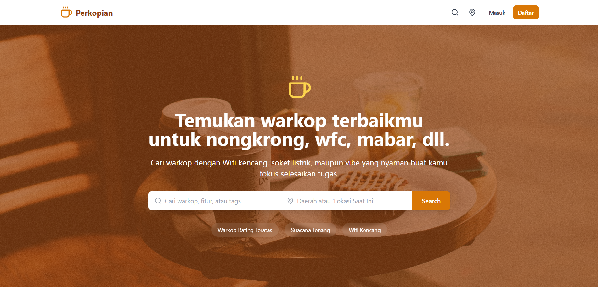
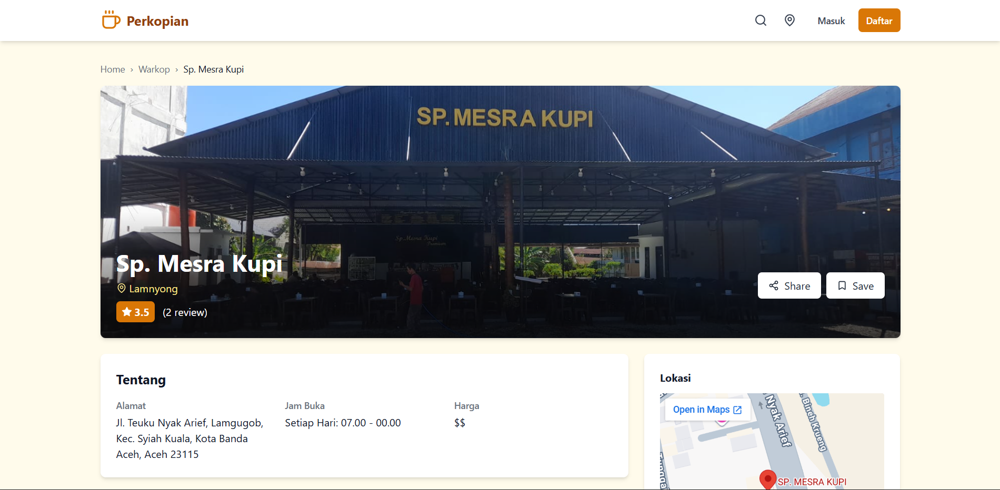

# ☕ Perkopian

> Find work-friendly cafés in Indonesia — search by WiFi quality, power outlets, noise level, and comfort.

<p align="center">
  <a href="#-english">🇬🇧 English</a> &nbsp;|&nbsp; <a href="#-bahasa-indonesia">🇮🇩 Bahasa Indonesia</a>
</p>

**🔗 Live Demo:** [perkopian.vercel.app](https://perkopian.vercel.app/)

### 📸 Screenshots
 
| Halaman Utama | Detail Warkop |
|---|---|
|  |  |
 
---

## 🇬🇧 English

### About

**Perkopian** is a web app that helps remote workers and students in Indonesia find cafés suited for focused work ("nongkrong" or WFC — Work From Café). Users can search and filter cafés by WiFi quality, power outlet availability, noise level, price, and comfort, then read and write detailed reviews.

This project started as a scaffold generated with [Bolt.new](https://bolt.new). I then exported it, pushed it to a self-managed Git repository, refactored the code, fixed several bugs, and deployed it independently to Vercel.

### Features

- 🔍 Search & filter cafés by WiFi quality, power outlets, noise level, price, and comfort
- ⭐ Café detail page with aggregated ratings from all reviews
- ✍️ Create, edit, and delete reviews; mark reviews as helpful
- 🔖 Bookmark favorite cafés
- 🔐 Authentication (login/signup) with "remember me" support
- 👤 User profile management (bio, location, avatar, password)

### Tech Stack

| Category | Technology |
|---|---|
| Frontend | React 18, TypeScript, Vite |
| Styling | Tailwind CSS |
| Backend & Database | Supabase (Auth + PostgreSQL) |
| Routing | React Router v6 |
| Others | Lucide React (icons), React Hot Toast (notifications) |

### Getting Started

#### Prerequisites

- Node.js 18+ and npm
- A [Supabase](https://supabase.com) project (URL + anon key)

#### Installation

```bash
git clone https://github.com/aidilkamal-eng/perkopian.git
cd perkopian
npm install
```

#### Environment Variables

Create a `.env` file in the project root:

```env
VITE_SUPABASE_URL=your_supabase_project_url
VITE_SUPABASE_ANON_KEY=your_supabase_anon_key
```

#### Run locally

```bash
npm run dev
```

#### Other scripts

```bash
npm run build     # production build
npm run lint       # run ESLint
npm run preview    # preview the production build
```

### License

© 2026 M. Aidil Kamal Adlim. All rights reserved.
This project is published for portfolio purposes. Please contact me before reusing any part of this code.

### Contact

- LinkedIn: linkedin.com/in/aidilkamal
- Email: aidilkamal.eng@gmail.com

---

## 🇮🇩 Bahasa Indonesia

### Tentang Project

**Perkopian** adalah aplikasi web yang membantu pekerja remote dan mahasiswa di Indonesia menemukan warkop yang cocok untuk fokus bekerja atau belajar (WFC — Work From Café). Pengguna dapat mencari dan memfilter warkop berdasarkan kualitas WiFi, ketersediaan soket listrik, tingkat kebisingan, harga, dan kenyamanan, lalu membaca maupun menulis review secara detail.

Project ini awalnya dibuat dari scaffold [Bolt.new](https://bolt.new). Saya kemudian meng-export-nya, push ke repository Git milik sendiri, melakukan refactor kode, memperbaiki beberapa bug, dan men-deploy secara mandiri ke Vercel.

### Fitur

- 🔍 Cari & filter warkop berdasarkan kualitas WiFi, soket listrik, kebisingan, harga, dan kenyamanan
- ⭐ Halaman detail warkop dengan rating rata-rata dari seluruh review
- ✍️ Buat, edit, dan hapus review; tandai review sebagai membantu
- 🔖 Simpan (bookmark) warkop favorit
- 🔐 Autentikasi (login/daftar) dengan dukungan "ingat saya"
- 👤 Pengelolaan profil pengguna (bio, lokasi, avatar, password)

### Tech Stack

| Kategori | Teknologi |
|---|---|
| Frontend | React 18, TypeScript, Vite |
| Styling | Tailwind CSS |
| Backend & Database | Supabase (Auth + PostgreSQL) |
| Routing | React Router v6 |
| Lainnya | Lucide React (ikon), React Hot Toast (notifikasi) |

### Getting Started

#### Prasyarat

- Node.js 18+ dan npm
- Project [Supabase](https://supabase.com) (URL + anon key)

#### Instalasi

```bash
git clone https://github.com/aidilkamal-eng/perkopian.git
cd perkopian
npm install
```

#### Environment Variables

Buat file `.env` di root project:

```env
VITE_SUPABASE_URL=url_project_supabase_anda
VITE_SUPABASE_ANON_KEY=anon_key_supabase_anda
```

#### Menjalankan secara lokal

```bash
npm run dev
```

#### Script lainnya

```bash
npm run build     # build untuk production
npm run lint       # menjalankan ESLint
npm run preview    # preview hasil build production
```

### Lisensi

© 2026 M. Aidil Kamal Adlim. Seluruh hak cipta dilindungi.
Project ini dipublikasikan untuk keperluan portofolio. Mohon hubungi saya terlebih dahulu sebelum menggunakan ulang bagian mana pun dari kode ini.

### Kontak

- LinkedIn: linkedin.com/in/aidilkamal
- Email: aidilkamal.eng@gmail.com